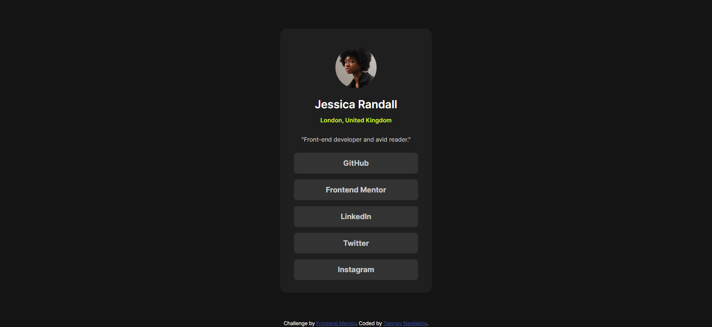

# Frontend Mentor - Social Links Profile Page Solution

This is a solution to the [Social Links Profile challenge on Frontend Mentor](https://www.frontendmentor.io/challenges/social-links-profile-UG32l9m6dQ). Frontend Mentor challenges help you improve your coding skills by building realistic projects.

## Table of Contents

- [Overview](#overview)
  - [The Challenge](#the-challenge)
  - [Screenshot](#screenshot)
  - [Links](#links)
- [My Process](#my-process)
  - [Built With](#built-with)
  - [What I Learned](#what-i-learned)
  - [Continued Development](#continued-development)
  - [Useful Resources](#useful-resources)
- [Author](#author)
- [Acknowledgments](#acknowledgments)

## Overview

### The Challenge

Users should be able to see hover and focus states for all interactive elements on the page.

### Screenshot

### Links

- Solution URL: [https://github.com/TanmayNawlakhe/Social-Links-Page](https://github.com/TanmayNawlakhe/Social-Links-Page)
- Live Site URL: [https://social-links-page-kappa.vercel.app](https://social-links-page-kappa.vercel.app/)

## My Process

### Built With

- Semantic HTML5 markup
- CSS custom properties
- Flexbox
- Mobile-first workflow

### What I Learned

During this project, I learned how to use flexbox to create responsive layouts and manage spacing between elements efficiently. Additionally, I improved my CSS skills by implementing hover and focus states for interactive elements.

### Continued Development

In future projects, I plan to further enhance my skills in CSS Grid and explore JavaScript for adding dynamic interactivity to web applications.

### Useful Resources

- [MDN Web Docs](https://developer.mozilla.org/en-US/docs/Web) - Comprehensive web development documentation.
- [CSS-Tricks](https://css-tricks.com/) - Helpful articles and tips on CSS and frontend development.

## Author

- Frontend Mentor - [@TanmayNawlakhe](https://www.frontendmentor.io/profile/TanmayNawlakhe)
- Github - [@TanmayNawlakhe](https://github.com/TanmayNawlakhe)

## Acknowledgments

I would like to acknowledge the Frontend Mentor community for providing valuable feedback and support throughout this project. 
---
